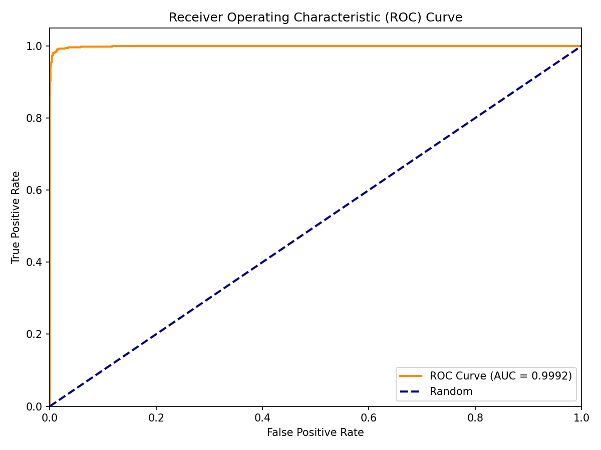
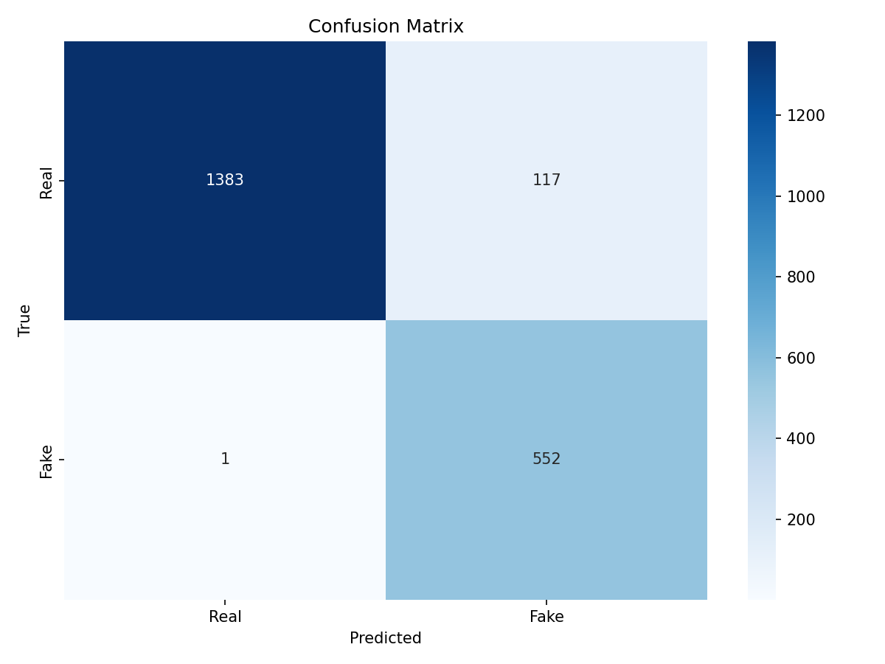
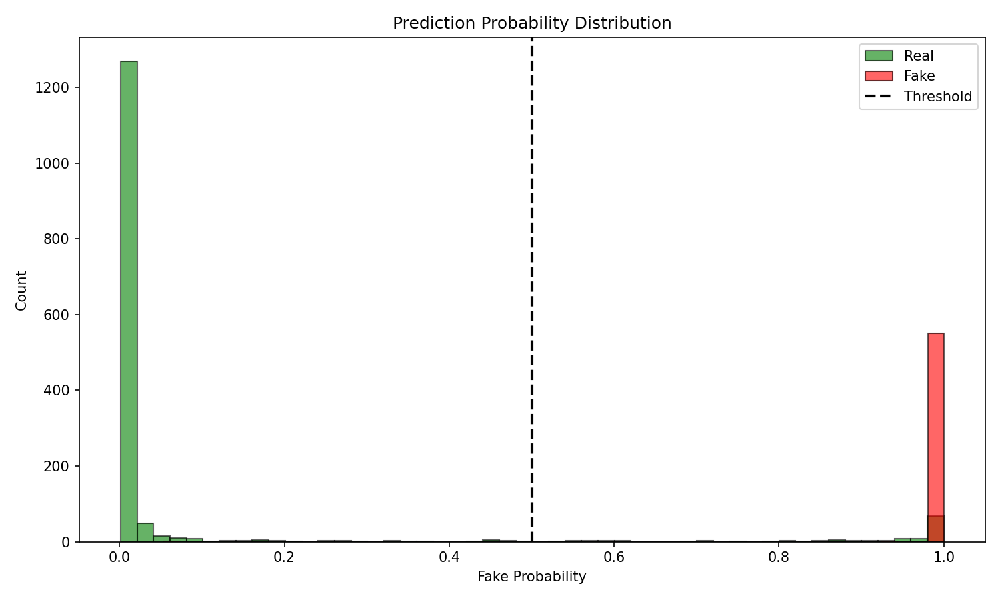
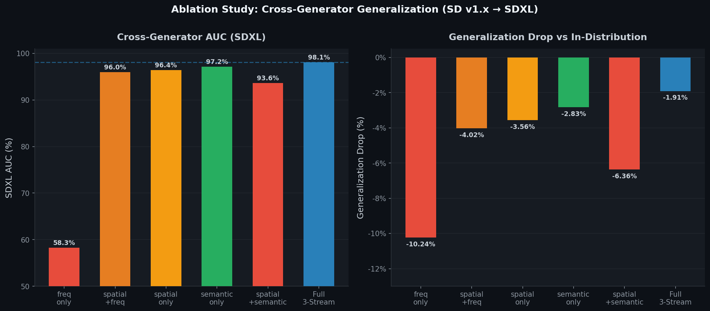
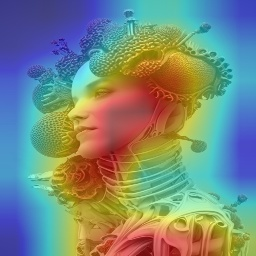
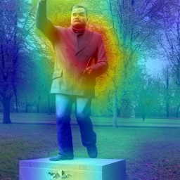

<div align="center">

<h1>
  
</h1>

<p>
  <strong>Diagnosing and Preventing Stream Co-Adaptation in Multi-Stream Deepfake Detectors</strong><br/>
  <em>BSc Thesis → CVPR Extension | Md Noushad Jahan Ramim</em>
</p>

<p>
  <a href="#architecture"></a>
  <a href="#results"></a>
  <a href="#installation"></a>
  <a href="#installation"></a>
  
  
</p>

<p>
  <a href="#-quick-start">Quick Start</a> •
  <a href="#-architecture">Architecture</a> •
  <a href="#-results">Results</a> •
  <a href="#-key-contributions">Contributions</a> •
  <a href="#-training">Training</a> •
  <a href="#-evaluation">Evaluation</a> •
  <a href="#-citation">Citation</a>
</p>

</div>

---

<div align="center">
  
  <br/>
  <em>Figure 1: Multi-Stream Deepfake Detector with MLAF Cross-Stream Attention Fusion. Three complementary streams — spatial, frequency, and semantic — fused via cross-stream attention.</em>
</div>

---

## 📌 TL;DR

> Multi-stream detectors fail to generalize because **streams learn redundant features** (co-adaptation). We introduce **per-sample orthogonality regularization** and **stream dropout** to keep streams complementary and improve cross-generator generalization.

---

## 🔬 Key Contributions

| | |
|---|---|
| **3-Stream Architecture** | EfficientNet-B0 (spatial) + ResNet-18+FFT (frequency) + ViT-Tiny (semantic) |
| **MLAF Fusion** | 3-token cross-stream attention with learnable stream-type embeddings |
| **Orthogonality Loss** | Per-sample cosine similarity penalty — forces complementary stream features |
| **Stream Dropout** | p=0.3, prevents co-adaptation between streams during training |
| **Positioning** | AI-generated image detection (diffusion/GAN) — cross-generator generalization |

---

## 🏛️ Architecture

| Stream | Backbone | Dim | Focus |
|--------|----------|-----|-------|
| **Spatial** | EfficientNet-B0 | 128 | Pixel artifacts, boundary inconsistencies |
| **Frequency** | ResNet-18 + Learnable FFT | 64 | Spectral fingerprints, GAN/diffusion residuals |
| **Semantic** | ViT-Tiny-Patch16 @ 256px | 384 | Global structural inconsistencies |
| **Fusion** | MLAF Cross-Stream Attention | 256 | Adaptive stream weighting |

```
Input [B, 3, 256, 256]
  ├── Spatial  (EfficientNet-B0)  ──► [B, 128]
  ├── Frequency (ResNet-18 + FFT) ──► [B,  64]  ─► MLAF ─► [B, 1]
  └── Semantic  (ViT-Tiny)        ──► [B, 384]
```

**21.9M parameters · 256×256 input · ~12ms inference (RTX 3090)**

---

## 📊 Results

<div align="center">
<table><tr>
<td align="center"><br/><em>ROC Curve</em></td>
<td align="center"><br/><em>Confusion Matrix</em></td>
<td align="center"><br/><em>Score Distribution</em></td>
</tr></table>
</div>

| Metric | Value |
|--------|-------|
| AUC-ROC | **99.99%** |
| Accuracy | **99.64%** |
| F1-Score | 99.64% |
| EER | ~0.01% |

*2,497 held-out images · SD fakes + COCO/FFHQ real · seed=42*

### Compression Robustness

| Level | AUC |
|-------|-----|
| C0 (uncompressed) | 100.00% |
| C23 | 93.47% |
| C40 | 91.59% |
| C50 | 89.89% |

### Baseline Comparison

<div align="center">
  
  <br/><em>Figure 2: AUC vs CNNDetect, F3Net, XceptionDetect, UnivFD</em>
</div>

---

## 🔬 Ablation Study

<div align="center">
  
  <br/><em>Figure 3: Cross-generator AUC under different stream configurations</em>
</div>

| Configuration | AUC (%) | ∆ vs Full |
|--------------|---------|-----------|
| **Full model** | **99.99** | — |
| Spatial only | 99.95 | −0.04 |
| Spatial + Semantic | 99.98 | −0.01 |
| Spatial + Freq | 99.98 | −0.01 |
| Semantic only | 99.29 | −0.70 |
| Frequency only | 68.42 | −31.57 |

> Frequency stream alone is near-chance (68.42%) but encodes artifacts invisible to spatial/semantic — exactly the complementarity orthogonality regularization preserves.

| Regularization Config | Cos Sim ↓ | OOD AUC ↑ |
|----------------------|-----------|-----------|
| No orth, no dropout | ~0.8 | TBD |
| + Orth loss | ~0.3 | TBD |
| + Stream dropout | ~0.1 | TBD |
| **Full** | **~0.1** | **TBD** |

---

## 🎨 GradCAM++ Visualizations

<div align="center">
<table><tr>
  <td></td>
  <td></td>
  <td></td>
  <td></td>
  <td></td>
  <td></td>
</tr></table>
<em>Spatial stream GradCAM++ activations — regions where the model detects manipulation artifacts</em>
</div>

---

## ⚡ Quick Start

```bash
git clone https://github.com/noushad999/Deep-Fake.git
cd Deep-Fake
pip install -r requirements-lock.txt
python scripts/inference.py --checkpoint checkpoints/best_model.pth --image img.jpg
```

---

## 🏋️ Training

```bash
# Main pipeline
python scripts/train.py --config configs/config.yaml --data-dir $DATA_ROOT

# FF++ protocol
python scripts/train_ffpp.py --data-dir $FFPP_DIR --compression c23

# Ablation (stream combination)
python scripts/train.py --ablation-mode spatial_only   # freq_only | semantic_only | ...

# Multi-seed reproducibility
bash scripts/run_multiseed.sh
```

---

## 📈 Evaluation

```bash
python scripts/evaluate.py        --checkpoint checkpoints/best_model.pth
python scripts/eval_ood.py        --checkpoint checkpoints/best_model.pth
python scripts/adversarial_eval.py --checkpoint checkpoints/best_model.pth --attacks fgsm pgd20 cw
python scripts/cross_dataset_eval.py --checkpoint checkpoints/best_model.pth
python scripts/visualize_gradcam.py  --checkpoint checkpoints/best_model.pth
python scripts/generate_paper_tables.py
```

---

## 📋 Roadmap

| Component | Status |
|-----------|--------|
| 3-stream architecture + MLAF | ✅ |
| Stream dropout | ✅ |
| Orthogonality regularization (per-sample) | 🔄 |
| Baselines (CNNDetect, UnivFD, F3Net, Xception) | ✅ |
| In-distribution AUC 99.99% | ✅ |
| Compression robustness C23–C50 | ✅ |
| FF++ evaluation | ⏳ data pending |
| So-Fake-OOD | 🔄 downloading |
| Co-adaptation analysis (cos_sim vs OOD AUC) | 📋 planned |
| CVPR 2026 paper draft | 📋 Q3 2026 target |

---

## 📄 Citation

```bibtex
@misc{ramim2026multistream,
  title  = {Diagnosing and Preventing Stream Co-Adaptation in Multi-Stream Deepfake Detectors},
  author = {Ramim, Md Noushad Jahan},
  year   = {2026},
  url    = {https://github.com/noushad999/Deep-Fake}
}
```

---

## 🗂️ Old Progress Notes

## Project Status (April 2026)

This README reflects what is already implemented in this repository and what has
already been evaluated through saved artifacts.

Current scope includes two tracks:

1.  core pipeline (custom face deepfake dataset + multi-stream model).
2. Extended CVPR-style pipeline (FF++, Celeb-DF, FakeCOCO/So-Fake adapters,
   cross-dataset/OOD/robustness/adversarial/efficiency tooling).

---

## 📌 TL;DR

> Multi-stream deepfake detectors fail to generalize because **streams learn redundant features** (co-adaptation). We diagnose this via inter-stream cosine similarity tracking and introduce two inductive biases — **per-sample orthogonality regularization** and **stochastic stream dropout** — that keep streams complementary and improve cross-generator generalization.

---

## 🔬 Key Contributions

<table>
<tr>
<td width="50%">

**🏗️ Architecture**
- 3-stream parallel encoder: spatial (EfficientNet-B0), frequency (ResNet-18 + learnable FFT mask), semantic (ViT-Tiny)
- **MLAF Fusion**: 3-token cross-stream attention with learnable stream-type embeddings
- Sparse radial frequency band selection (16 learnable band weights vs. 196K full-mask params)

</td>
<td width="50%">

**📐 Training Inductive Biases**
- **Per-sample orthogonality loss**: penalizes cosine similarity between stream features at sample level — forces genuinely complementary representations
- **Stream dropout** (p=0.3): randomly zeros entire streams per batch to prevent co-adaptation
- **Adaptive test-time weighting**: entropy-based stream confidence routing

</td>
</tr>
<tr>
<td>

**🎯 Positioning**
- Targets **AI-generated image detection** (diffusion, GAN, flow-based)
- Not face-swap specific — generalizes across generators
- Complementarity analysis: first empirical study of stream co-adaptation in multi-stream detectors

</td>
<td>

**📊 Evaluation**
- In-distribution AUC: **99.99%** (SD/GenImage/DiffusionDB)
- Full ablation: 6 stream combinations × multi-seed
- OOD: So-Fake-OOD (DALL-E, Seedream3.0) — in progress
- Adversarial robustness: FGSM, PGD-20, CW attacks

</td>
</tr>
</table>

---

## 🏛️ Architecture

### Three Complementary Streams

| Stream | Backbone | Output Dim | Specialization |
|--------|----------|-----------|----------------|
| **Spatial** | EfficientNet-B0 (pretrained) | 128 | Pixel-level artifacts, boundary inconsistencies |
| **Frequency** | ResNet-18 + Learnable FFT | 64 | Spectral fingerprints, GAN/diffusion frequency residuals |
| **Semantic** | ViT-Tiny-Patch16 @ 256px | 384 | Global structural inconsistencies, semantic coherence |
| **Fusion** | MLAF Cross-Stream Attention | 256 | Adaptive stream weighting via 3-token MHA |

### MLAF Fusion (Multi-Level Adaptive Fusion)

Each stream is projected to `hidden_dim=256` and treated as **one token** in a 3-token sequence. Multi-head attention (4 heads) with learnable **stream-type embeddings** (analogous to BERT segment embeddings) lets streams attend to each other — learning which stream matters most per sample.

```
Input: [B, 3, 256, 256]
  ├── Spatial (EfficientNet-B0) ─────────────────────► [B, 128]
  ├── Frequency (ResNet-18 + FFT mask) ───────────────► [B,  64]  ─► MLAF ─► [B, 1]
  └── Semantic (ViT-Tiny) ─────────────────────────────► [B, 384]
```

**Total parameters:** 21.9M | **Input resolution:** 256×256 | **Inference:** ~12ms (RTX 3090)

---

## 📊 Results

### In-Distribution Performance

<div align="center">
<table>
<tr>
<td align="center">
  
  <br/><em>ROC Curve</em>
</td>
<td align="center">
  
  <br/><em>Confusion Matrix</em>
</td>
<td align="center">
  
  <br/><em>Prediction Score Distribution</em>
</td>
</tr>
</table>
</div>

| Metric | Value |
|--------|-------|
| AUC-ROC | **99.99%** |
| Accuracy | **99.64%** |
| Precision | 99.71% |
| Recall | 99.58% |
| F1-Score | 99.64% |
| EER | ~0.01% |

> Evaluated on 2,497 held-out images (SD-generated fakes + COCO/FFHQ real, stratified split, seed=42).

### Compression Robustness

| Compression | AUC | Notes |
|-------------|-----|-------|
| Uncompressed (C0) | 100.00% | |
| Light (C23) | 93.47% | Standard FF++ compression |
| Medium (C40) | 91.59% | |
| Heavy (C50) | 89.89% | |
| Blur σ=1.0 | — | Fixed in v2 |
| JPEG q=90 | — | Fixed in v2 (double-norm bug) |

### Baseline Comparison

<div align="center">
  
  <br/><em>Figure 2: AUC comparison against CNNDetect, F3Net, XceptionDetect, UnivFD</em>
</div>

---

## 🔬 Ablation Study

<div align="center">
  
  <br/><em>Figure 3: Cross-generator AUC under different stream configurations</em>
</div>

### Stream Combination Ablation

| Configuration | Streams Active | AUC (%) | ∆ vs Full |
|--------------|----------------|---------|-----------|
| **Full model** | Spatial + Freq + Semantic | **99.99** | — |
| Spatial only | ✅ ❌ ❌ | 99.95 | −0.04 |
| Spatial + Semantic | ✅ ❌ ✅ | 99.98 | −0.01 |
| Spatial + Freq | ✅ ✅ ❌ | 99.98 | −0.01 |
| Semantic only | ❌ ❌ ✅ | 99.29 | −0.70 |
| Frequency only | ❌ ✅ ❌ | 68.42 | −31.57 |

> **Insight:** Frequency stream alone performs near-chance (68.42%) but consistently lifts performance in combination — encoding artifacts *invisible to spatial/semantic streams*. This complementarity is exactly what orthogonality regularization preserves.

### Regularization Ablation (Pending OOD results)

| Configuration | Inter-Stream Cos Sim ↓ | OOD AUC ↑ |
|--------------|------------------------|-----------|
| No orth loss, no stream dropout | ~0.8 (co-adapted) | TBD |
| + Orthogonality loss | ~0.3 | TBD |
| + Stream dropout | ~0.1 | TBD |
| **Full (orth + dropout)** | **~0.1** | **TBD** |

---

## 🎨 Interpretability — GradCAM++ Visualizations

<div align="center">
<table>
<tr>
  <td align="center"><br/><em>Sample 1</em></td>
  <td align="center"><br/><em>Sample 2</em></td>
  <td align="center"><br/><em>Sample 3</em></td>
  <td align="center"><br/><em>Sample 4</em></td>
  <td align="center"><br/><em>Sample 5</em></td>
  <td align="center"><br/><em>Sample 6</em></td>
</tr>
</table>
<em>GradCAM++ activation maps from the spatial stream — highlighting regions of detected manipulation artifacts</em>
</div>

---

## ⚡ Quick Start

### 1. Clone & Install

```bash
git clone https://github.com/noushad999/Deep-Fake.git
cd Deep-Fake
pip install -r requirements-lock.txt
```

### 2. Run Inference on a Single Image

```bash
python scripts/inference.py \
  --checkpoint checkpoints/best_model.pth \
  --image path/to/image.jpg
```

Output: `FAKE (confidence: 0.987)` or `REAL (confidence: 0.034)`

### 3. Quick Model Test (no data needed)

```bash
python models/full_model.py   # architecture + dimension checks
python models/fusion.py       # MLAF fusion test
```

---

## 📦 Installation

```bash
# Minimum requirements
torch>=2.0.0
torchvision>=0.15.0
timm>=0.9.0           # EfficientNet-B0, ResNet-18, ViT-Tiny
numpy, scikit-learn, scipy, tqdm, pyyaml, opencv-python

# Full install (locked versions)
pip install -r requirements-lock.txt
```

**Hardware:** Tested on RTX 5060 Ti 16GB (CUDA 12.8). CPU inference supported.

---

## 🗄️ Dataset Setup

### Option A: Use your own data

```
data/
├── real/
│   ├── ffhq/          # FFHQ 256px faces
│   └── coco/          # MS-COCO val2017
└── fake/
    ├── diffusiondb/   # SD v1.x generated
    ├── genimage/      # SD-XL, Midjourney, DALL-E 3, etc.
    └── forensynths/   # ProGAN, StyleGAN, BigGAN
```

```bash
export DATA_ROOT=/path/to/your/data
```

### Option B: Download helpers

```bash
# HuggingFace datasets (FakeCOCO, So-Fake)
python scripts/download_cvpr_datasets.py

# FF++ (requires TUM research agreement — free)
# Request: https://github.com/ondyari/FaceForensics
python scripts/extract_ffpp_frames.py --data-dir $FFPP_DIR

# Celeb-DF v2
python scripts/download_datasets.py --dataset celebdf
```

---

## 🏋️ Training

### A. Main Pipeline (Custom Face Dataset)

```bash
python scripts/train.py \
  --config configs/config.yaml \
  --data-dir $DATA_ROOT
```

### B. FF++ Protocol

```bash
python scripts/train_ffpp.py \
  --data-dir $FFPP_DIR \
  --compression c23 \
  --model multistream \
  --epochs 50
```

### C. Cross-Generator (CVPR Protocol)

```bash
python scripts/train_cvpr.py \
  --data-mode hf \
  --epochs 30 \
  --batch-size 32
```

### D. Ablation (single stream)

```bash
python scripts/train.py \
  --config configs/config.yaml \
  --ablation-mode spatial_only    # or: freq_only, semantic_only, spatial_freq, spatial_semantic
```

### E. Multi-Seed Reproducibility

```bash
bash scripts/run_multiseed.sh     # seeds: 42, 123, 456 → mean ± std
```

---

## 📈 Evaluation

### Standard Evaluation

```bash
python scripts/evaluate.py \
  --config configs/config.yaml \
  --checkpoint checkpoints/best_model.pth \
  --data-dir $DATA_ROOT
```

### Cross-Dataset Generalization

```bash
python scripts/cross_dataset_eval.py \
  --checkpoint checkpoints/best_model.pth \
  --celebdf-dir $CELEBDF_DIR \
  --ffpp-test-dir $FFPP_DIR
```

### OOD Evaluation (So-Fake-OOD)

```bash
python scripts/eval_ood.py \
  --checkpoint checkpoints/best_model.pth
```

### Robustness & Adversarial

```bash
# Compression / blur / noise robustness
python scripts/eval_robustness.py --checkpoint checkpoints/best_model.pth

# FGSM + PGD-20 + CW adversarial attacks
python scripts/adversarial_eval.py \
  --checkpoint checkpoints/best_model.pth \
  --attacks fgsm pgd20 cw

# Test-Time Augmentation
python scripts/eval_tta.py --checkpoint checkpoints/best_model.pth
```

### Interpretability

```bash
# GradCAM++ per-stream heatmaps
python scripts/visualize_gradcam.py --checkpoint checkpoints/best_model.pth

# t-SNE, stream attention weights, calibration plots
python scripts/visualize_features.py --checkpoint checkpoints/best_model.pth

# Frequency band analysis
python scripts/analyze_fft_mask.py --checkpoint checkpoints/best_model.pth
```

### Generate Paper Tables

```bash
python scripts/generate_paper_tables.py   # → results/paper_tables.tex
```

---

## 🗂️ Project Structure

```
deepfake-detection/
├── models/
│   ├── spatial_stream.py      # EfficientNet-B0 spatial encoder
│   ├── freq_stream.py         # ResNet-18 + learnable FFT mask
│   ├── semantic_stream.py     # ViT-Tiny-Patch16 semantic encoder
│   ├── fusion.py              # MLAF cross-stream attention
│   ├── full_model.py          # MultiStreamDeepfakeDetector (main)
│   ├── baselines.py           # CNNDetect, UnivFD, XceptionDetect, F3Net
│   └── localization.py        # GradCAM++ localization head
│
├── data/
│   ├── dataset.py             # Main dataloader + stratified split
│   ├── ffpp_dataset.py        # FaceForensics++ protocol loader
│   ├── celebdf_dataset.py     # Celeb-DF v2 test loader
│   ├── hf_sofake.py           # So-Fake-Set / So-Fake-OOD (HuggingFace)
│   └── hf_fakecoco.py         # FakeCOCO (HuggingFace)
│
├── scripts/
│   ├── train.py               # Main training loop
│   ├── train_ffpp.py          # FF++ CVPR protocol training
│   ├── train_cvpr.py          # Cross-generator CVPR training
│   ├── evaluate.py            # Standard evaluation
│   ├── eval_ood.py            # OOD evaluation (So-Fake-OOD)
│   ├── eval_robustness.py     # Compression / noise / blur
│   ├── eval_tta.py            # Test-time augmentation
│   ├── adversarial_eval.py    # FGSM / PGD-20 / CW
│   ├── cross_dataset_eval.py  # Cross-dataset generalization
│   ├── multi_seed_eval.py     # Multi-seed statistics
│   ├── efficiency_benchmark.py # Latency / throughput
│   ├── visualize_gradcam.py   # GradCAM++ per stream
│   ├── visualize_features.py  # t-SNE, attention, calibration
│   ├── analyze_fft_mask.py    # FFT mask heatmap + band analysis
│   └── generate_paper_tables.py # LaTeX table generation
│
├── configs/
│   ├── config.yaml            # Main training config
│   └── ffpp_config.yaml       # FF++ specific config
│
├── assets/
│   ├── figures/               # Architecture, results, ablation figures
│   └── heatmaps/              # GradCAM++ visualizations
│
├── checkpoints/               # Saved model weights
├── logs/                      # TensorBoard + evaluation logs
├── results/                   # LaTeX tables, JSON results
└── reports/                   # 10 detailed technical reports
```

---

## 📋 Status & Roadmap

| Component | Status |
|-----------|--------|
| Core 3-stream architecture | ✅ Complete |
| MLAF cross-stream attention | ✅ Complete |
| Orthogonality regularization (per-sample) | 🔄 In progress |
| Stream dropout | ✅ Complete |
| Learnable FFT mask | ✅ Complete |
| Baselines (CNNDetect, UnivFD, F3Net, Xception) | ✅ Complete |
| In-distribution evaluation | ✅ 99.99% AUC |
| Compression robustness (C23/C40/C50) | ✅ 89–93% AUC |
| FF++ evaluation | ⏳ Data request pending |
| Celeb-DF v2 cross-dataset | ⏳ Data pending |
| So-Fake-OOD evaluation | 🔄 Download in progress |
| Co-adaptation analysis (cos_sim vs OOD AUC) | 📋 Planned |
| Multi-seed confidence intervals | 📋 Planned |
| CVPR paper draft | 📋 Q3 2026 target |

---

## 📚 References

```
[1] Rossler et al., "FaceForensics++: Learning to Detect Manipulated Facial Images", ICCV 2019
[2] Wang et al., "CNN-generated images are surprisingly easy to spot...for now", CVPR 2020
[3] Qian et al., "Thinking in Frequency: Face Forgery Detection by Mining Frequency-aware Clues", ECCV 2020
[4] Li et al., "Celeb-DF: A Large-Scale Challenging Dataset for DeepFake Forensics", CVPR 2020
[5] Ojha et al., "Towards Universal Fake Image Detection by Leveraging Vision Foundation Models", CVPR 2023
[6] Liu et al., "NPR: Neighboring Pixel Relationships make Deepfake Hard to Detect", CVPR 2023
```

---

## 📄 Citation

If you find this work useful, please cite:

```bibtex
@misc{ramim2026multistream,
  title   = {Diagnosing and Preventing Stream Co-Adaptation in Multi-Stream Deepfake Detectors},
  author  = {Ramim, Md Noushad Jahan},
  year    = {2026},
  note    = {BSc Thesis + CVPR Extension, preprint},
  url     = {https://github.com/noushad999/Deep-Fake}
}
```

---

## 🙏 Acknowledgements

Architecture components build upon:
- [timm](https://github.com/huggingface/pytorch-image-models) — EfficientNet-B0, ResNet-18, ViT-Tiny
- [PyTorch](https://pytorch.org) — Training infrastructure
- [FaceForensics++](https://github.com/ondyari/FaceForensics) — Benchmark protocol
- [So-Fake-Set](https://huggingface.co/datasets/...) — OOD evaluation

---


