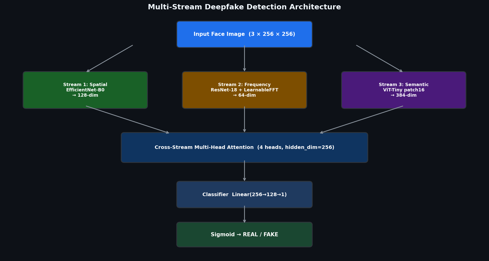

<div align="center">

# Deepfake Detection Research Workspace

End-to-end implementation of a multi-stream deepfake detector with extended
training and evaluation pipelines (custom face datasets, FF++, Celeb-DF,
cross-generator, OOD, robustness, TTA, adversarial, efficiency, and analysis
tools).

[](https://python.org)
[](https://pytorch.org)
[](https://developer.nvidia.com/cuda-toolkit)
[](#project-status-april-2026)

</div>

---

## Project Status (April 2026)

This README reflects what is already implemented in this repository and what has
already been evaluated through saved artifacts.

Current scope includes two tracks:

1. Thesis core pipeline (custom face deepfake dataset + multi-stream model).
2. Extended CVPR-style pipeline (FF++, Celeb-DF, FakeCOCO/So-Fake adapters,
   cross-dataset/OOD/robustness/adversarial/efficiency tooling).

---

## What Has Been Completed So Far

### 1) Core model and architecture

- Implemented 3-stream detector:
  - Spatial stream: EfficientNet-B0 branch
  - Frequency stream: ResNet-based branch with learnable FFT mask
  - Semantic stream: ViT-tiny branch
- Implemented fusion with cross-stream multi-head attention in models/fusion.py.
- Added ablation modes in models/full_model.py:
  - spatial_only, freq_only, semantic_only, spatial_freq, spatial_semantic, full
- Added stream dropout and orthogonality regularization support in training
  paths.

### 2) Baselines

- Implemented baseline models in models/baselines.py:
  - CNNDetect
  - UnivFD (CLIP probe)
  - XceptionDetect
  - F3Net (frequency-aware)

### 3) Dataset/data pipeline

- Custom dataset loader and stratified split pipeline in data/dataset.py.
- FF++ loader with official split handling and frame/video evaluation support:
  data/ffpp_dataset.py.
- Celeb-DF v2 test loader and frame extraction helper: data/celebdf_dataset.py.
- HuggingFace adapters for cross-generator and OOD experiments:
  - data/hf_fakecoco.py
  - data/hf_sofake.py

### 4) Training pipelines

- Main training pipeline: scripts/train.py
- FF++ training protocol pipeline: scripts/train_ffpp.py
- CVPR-oriented cross-generator pipeline: scripts/train_cvpr.py

### 5) Evaluation and analysis toolkit

- Standard evaluation + GradCAM:
  - scripts/evaluate.py
  - scripts/evaluate_v2.py
  - scripts/visualize_gradcam.py
- Cross-dataset/generalization:
  - scripts/cross_generator_eval.py
  - scripts/cross_dataset_eval.py
  - scripts/eval_ood.py
- Robustness/testing:
  - scripts/eval_robustness.py
  - scripts/eval_tta.py
  - scripts/adversarial_eval.py
- Efficiency and representation analysis:
  - scripts/efficiency_benchmark.py
  - scripts/analyze_fft_mask.py
  - scripts/visualize_features.py
- Reporting utilities:
  - scripts/generate_paper_tables.py
  - results/paper_tables.tex

### 6) Documentation and reports

- 10 structured reports available in reports/.
- Presentation and progress documents maintained in root-level markdown files.

---

## Verified Artifacts In This Repo

Below are metrics that are already present as generated files.

### A) Main evaluation artifacts

- logs/evaluation/evaluation_metrics.json
  - Accuracy: 100.0
  - Precision: 100.0
  - Recall: 100.0
  - F1: 100.0
  - AUC-ROC: 100.0
  - Counts: TP=1350, TN=1800, FP=0, FN=0

- logs/evaluation/per_domain_results.json
  - Real domain and fake domain metrics both saved separately.

### B) Robustness v2 artifacts

- logs/evaluation_v2/compression_robustness.json
  - C0 AUC: 100.00
  - C23 AUC: 93.47
  - C40 AUC: 91.59
  - C50 AUC: 89.89

- logs/evaluation_v2/blur_robustness.json
  - Sigma 1 AUC: 96.15
  - Sigma 2 AUC: 93.02
  - Sigma 4 AUC: 91.79

- logs/evaluation_v2/noise_robustness.json
  - Up to sigma 0.1 all recorded at AUC 100.0 in current artifact.

### C) FF++ artifact

- checkpoints/ffpp/results_multistream_c23_seed42.txt
  - Frame-level: AUC 100, Acc 100, EER 0
  - Video-level: AUC 100, Acc 100, EER 0

### D) Extra robustness/TTA artifacts

- checkpoints/robustness_results.txt
- checkpoints/tta_results.txt

Note: Some utility scripts run on synthetic or reduced test inputs when no
external dataset path is provided. Always interpret metrics using the exact
artifact source.

---

## Model Architecture (Current)



| Component        | Backbone / Method             | Output Dim |
| ---------------- | ----------------------------- | ---------- |
| Spatial stream   | EfficientNet-B0               | 128        |
| Frequency stream | ResNet + learnable FFT mask   | 64         |
| Semantic stream  | ViT-tiny patch16              | 384        |
| Fusion           | Cross-stream attention (MLAF) | 256        |

---

## Quick Start

### 1) Clone and install

```bash
git clone https://github.com/noushad999/Deep-Fake.git
cd Deep-Fake
pip install -r requirements-lock.txt
```

### 2) Optional environment variables

```bash
export DATA_ROOT=/path/to/data
export FFPP_DIR=/path/to/FaceForensics++
export CELEBDF_DIR=/path/to/Celeb-DF-v2
```

### 3) Data preparation helpers

```bash
# Generic dataset download helpers
python scripts/download_datasets.py
python scripts/download_cvpr_datasets.py

# FF++ helper utilities
python scripts/extract_ffpp_frames.py
python scripts/generate_ffpp_dummy.py
```

---

## Training Workflows

### A) Main custom pipeline

```bash
python scripts/train.py \
  --config configs/config.yaml \
  --data-dir $DATA_ROOT/faces_dataset
```

### B) FF++ protocol pipeline

```bash
python scripts/train_ffpp.py \
  --data-dir $FFPP_DIR \
  --compression c23 \
  --model multistream
```

### C) CVPR-oriented cross-generator pipeline

```bash
python scripts/train_cvpr.py \
  --data-mode hf \
  --epochs 30 \
  --batch-size 32
```

---

## Evaluation Workflows

### Standard and robust evaluation

```bash
python scripts/evaluate.py \
  --config configs/config.yaml \
  --checkpoint checkpoints/best_model.pth \
  --data-dir $DATA_ROOT/faces_dataset

python scripts/evaluate_v2.py \
  --config configs/config.yaml \
  --checkpoint checkpoints/best_model.pth \
  --data-dir $DATA_ROOT/faces_dataset \
  --output-dir logs/evaluation_v2
```

### Cross-dataset and OOD

```bash
python scripts/cross_dataset_eval.py \
  --checkpoint checkpoints/ffpp/best_multistream_c23.pth \
  --celebdf-dir $CELEBDF_DIR \
  --ffpp-test-dir $FFPP_DIR

python scripts/eval_ood.py \
  --checkpoint checkpoints/best_model.pth
```

### Robustness, adversarial, efficiency, interpretability

```bash
python scripts/eval_robustness.py --checkpoint checkpoints/best_model.pth
python scripts/eval_tta.py --checkpoint checkpoints/best_model.pth

python scripts/adversarial_eval.py \
  --checkpoint checkpoints/best_model.pth \
  --data-dir $DATA_ROOT \
  --attacks fgsm pgd20

python scripts/efficiency_benchmark.py
python scripts/analyze_fft_mask.py --checkpoint checkpoints/best_model.pth
python scripts/visualize_gradcam.py --checkpoint checkpoints/best_model.pth
```

### Paper table generation

```bash
python scripts/generate_paper_tables.py
```

---

## Project Structure (Updated)

```text
deepfake-detection/
|- configs/
|  |- config.yaml
|  |- ffpp_config.yaml
|- data/
|  |- dataset.py
|  |- ffpp_dataset.py
|  |- celebdf_dataset.py
|  |- hf_fakecoco.py
|  |- hf_sofake.py
|- models/
|  |- spatial_stream.py
|  |- freq_stream.py
|  |- semantic_stream.py
|  |- fusion.py
|  |- full_model.py
|  |- baselines.py
|  |- localization.py
|- scripts/
|  |- train.py
|  |- train_ffpp.py
|  |- train_cvpr.py
|  |- evaluate.py
|  |- evaluate_v2.py
|  |- cross_dataset_eval.py
|  |- eval_ood.py
|  |- eval_robustness.py
|  |- eval_tta.py
|  |- adversarial_eval.py
|  |- efficiency_benchmark.py
|  |- analyze_fft_mask.py
|  |- visualize_features.py
|  |- visualize_gradcam.py
|  |- generate_paper_tables.py
|- checkpoints/
|- logs/
|- results/
|- reports/
```

---

## Known Notes and Current Gaps

- Some scripts are implementation-complete but still depend on full external
  dataset downloads to produce final publication-grade numbers.
- A few artifacts were generated in synthetic/dummy settings for pipeline
  validation, not final benchmark claims.
- FF++ per-type AUC in one artifact can be zero if computed on single-class
  subsets; use video/frame aggregate metrics as primary signal.

---

## Reports

Detailed project documents are in reports/:

1. report_01_project_overview.md
2. report_02_code_explained.md
3. report_03_figures_explained.md
4. report_04_architecture.md
5. report_05_defense_qa.md
6. report_06_dataset_pipeline.md
7. report_07_experimental_results.md
8. report_08_baseline_comparison.md
9. report_09_ablation_study.md
10. report_10_publication_guide.md

---

## References

1. Rossler et al., FaceForensics++, ICCV 2019.
2. Wang et al., CNNDetect, CVPR 2020.
3. Qian et al., F3Net, ECCV 2020.
4. Li et al., Celeb-DF v2, CVPR 2020.
5. Ojha et al., UnivFD, CVPR 2023.

---


